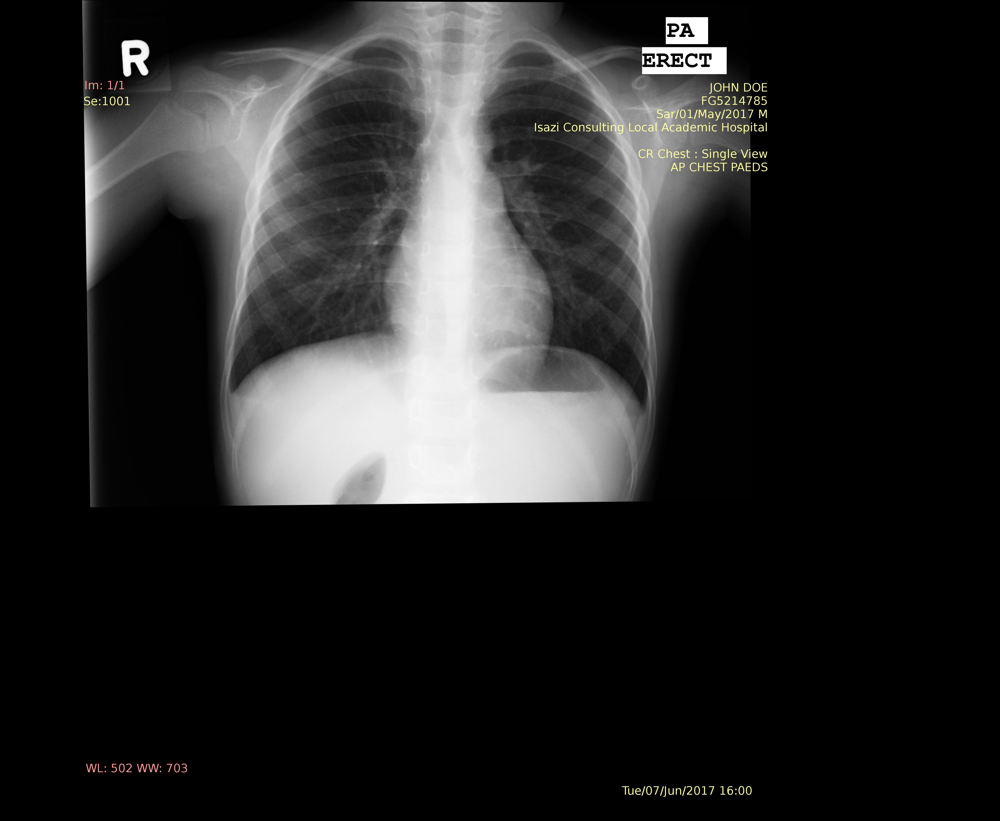
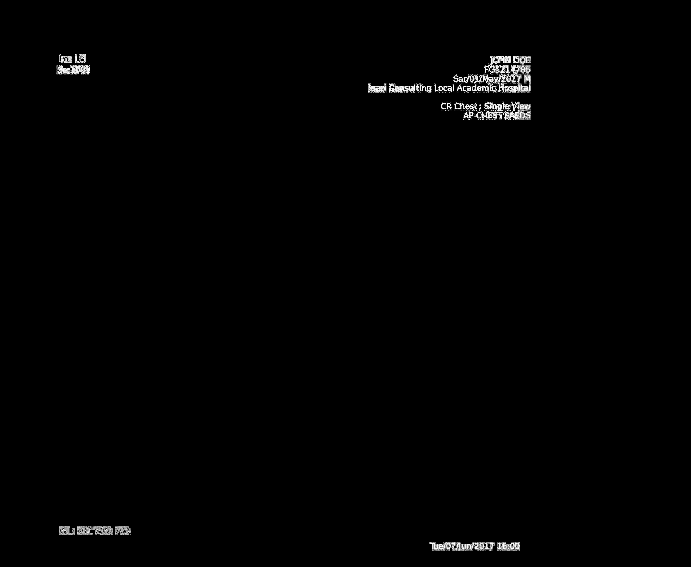
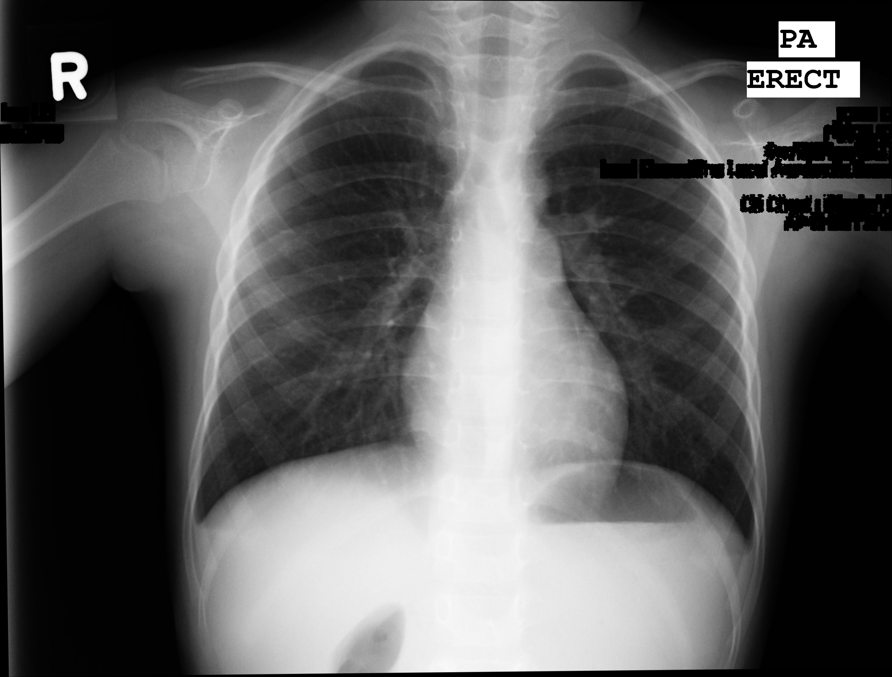
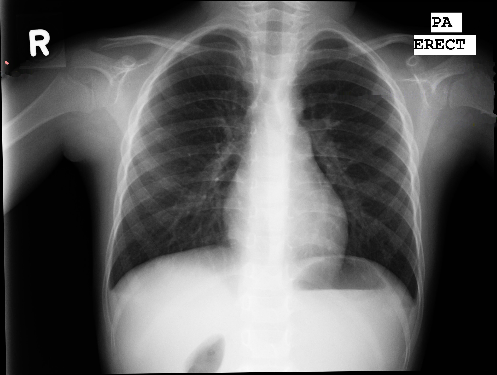
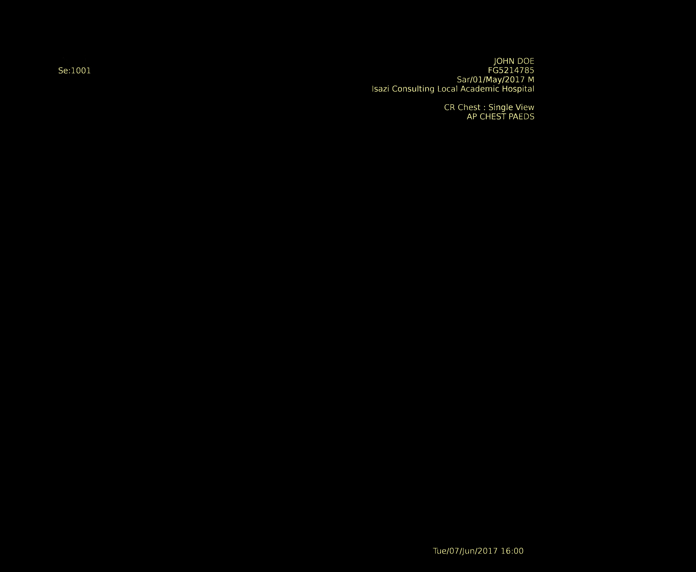

Anyone who has ever attempted to apply data science in the medical industry will understand the amount of red tape that one needs to go through in order to obtain data. Although understandable, this can really slow down the progression of a project, especially when large quantities of data are required.

We recently encountered this problem when trying to apply deep learning to x-ray images. Freely available datasets are few and far between, which meant we needed to gather data directly from local hospitals. Our first attempt at this took about three weeks for us to get a small subset back. This delay was primarily due to the fact that the x-rays needed to be completely anonymized before they could be handed over to us. As these kinds of delays are obviously impractical we decided to develop a desensitization tool that could be deployed to the hospital so that we could streamline this process.

# The Data

The raw data that we were receiving would be an x-ray arbitrarily placed on a black background with the sensitive patient information written across the x-ray in a yellow colour, much like the image seen below.

*NOTE: The image below was obtained from the [Montgomery County chest x-ray set](http://archive.nlm.nih.gov/repos/chestImages.php) and fake text was imposed onto the image*

    
    <figcaption style="font-size: 9pt">Fig 1. - Raw x-ray sample</figcaption>

# The Desensitization Tool

The desensitization tool had two primary functions, firstly to remove all sensitive patient information and secondly to OCR this information to obtain a unique hash of the patient's name as well as other metadata. The pipeline is summarized below.

    
    <figcaption style="font-size: 9pt">Fig 2. - Desensitization tool pipeline</figcaption>

## Text Localization

Localization of the text had to be 100% accurate in order to make the tool feasible. To achieve this we obtained the RGB vector for the yellow colour of the text and took the dot product of each pixel in the image with this vector in order to obtain a 'degree of yellowness' for each pixel. When plotting a histogram of the output it was clear which values corresponded to the image and which corresponded to the text. Thresholding these outputs produced the following result. An interesting thing to note is that this method is capable of differentiating all colour from gray which is evident by it being able to identify the red text as well.

    
    <figcaption style="font-size: 9pt">Fig 3. - Text localization mask</figcaption>

## Text Removal

Once the text has been localized there are two possible options for removing it: image interpolation or masking. Image interpolation, or inpainting, is a magical tool in image processing where the image appears as if the text never existed, whereas masking is simply blanking out the image where the text used to appear. The choice between the two is primarily based on how you believe the artifacts introduced by either method will affect your model's ability to learn. The last part of the text removal phase is to crop only the x-ray from the background. Check out the results below!

Fig 4a. - Inpainting

Fig 4b. - Masking

## Text OCR

Depending on your model it may be desired to get additional metadata in conjunction with the x-ray. From the information available on the x-ray it is possible to get the patient's name, date of birth, sex as well as the date that the x-ray was taken. Obviously the patient's name and date of birth is classified as sensitive information, so we decided to combine the two into a single string and take the one-way SHA-256 hash of it. This means that each patient would be identified by a unique combination of letters and numbers which cannot be linked back to their name and date of birth.

We decided to use [Tesseract OCR (4.0 with LSTM)](https://github.com/tesseract-ocr/tesseract/wiki/4.0-with-LSTM) to assist us with this aspect of the tool. Even though OCR technology has come a long way it still makes mistakes, especially on messy data. In order to overcome these errors we integrated the use of approximate median strings into the system. By this I mean we performed different morphological operations on the text in the image in order to obtain multiple results from the OCR. String median then takes all the different outputs obtained for a single image and determines the most likely set of text for that image. An example of the resulting images and corresponding outputs can be seen below.

    
    <figcaption style="font-size: 9pt">Fig 5. - Images resulting from different morphological operations</figcaption>

 

<table align="center" style="width:75%;font-size: 11pt">
<caption style="font-size: 9pt">Tab 1. - Example OCR outputs for string median with errors highlighted</caption>
  <tr>
    <th></th>
    <th>
<b>Name</b>
</th>
    <th>
<b>DOB</b>
</th> 
    <th>
<b>X-Ray Date</b>
</th>
    <th>
<b>Sex</b>
</th>
  </tr>
  <tr>
    <td>
<b>Image 1</b>
</td>
    <td>
JOHN DOE
</td>
    <td>
01 MAY 2017
</td>
    <td>
TUE 07 JUN 2017
</td>
    <td>
M
</td>
  </tr>
  <tr>
    <td>
<b>Image 2</b>
</td>
    <td>
EJOHN DOE
</td> 
    <td>
07 MAY 2017
</td> 
    <td>
TUF 01 JUN 2017
</td> 
    <td>
M
</td>
  </tr>
  <tr>
    <td>
<b>Image 3</b>
</td>
    <td>
JOHN BOE
</td>
    <td>
01 HAY 2017
</td>
    <td>
TUE 07 JUN 2017
</td>
    <td>
 H
</td>
  </tr>
  <tr>
    <td>
<b>Final</b>
</td>
    <td>
JOHN DOE
</td>
    <td>
01 MAY 2017
</td>
    <td>
TUE 07 JUN 2017
</td>
    <td>
M
</td>
  </tr>
</table>

# Closing Comments

The desensitization tool was built as a quick hack to try and streamline our data acquisition process, but actually turned out to be a handy little tool. The best part about it? We decided to open source it incase anyone out there was having a similar problem to us. The code can be found on our [Github](https://github.com/isaziconsulting/xray-desensitizer) account. We also decided to build a [Docker](https://cloud.docker.com/swarm/isazi/repository/docker/isazi/xray-desensitizer/general) container with all the OpenCV, Tesseract and Python dependencies installed so that the tool can just be used in a plug and play kind of fashion. Enjoy! 